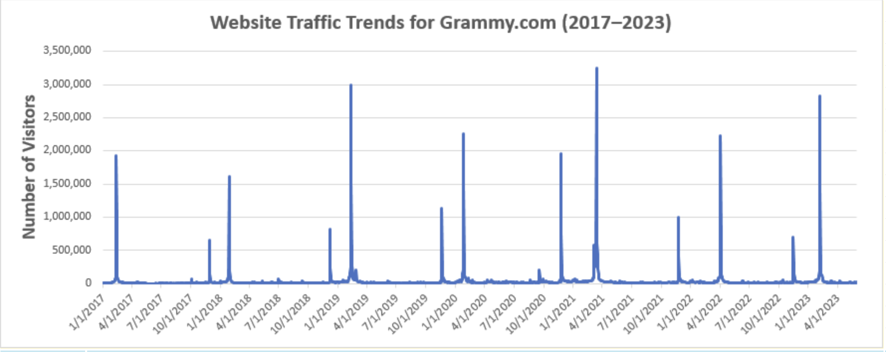
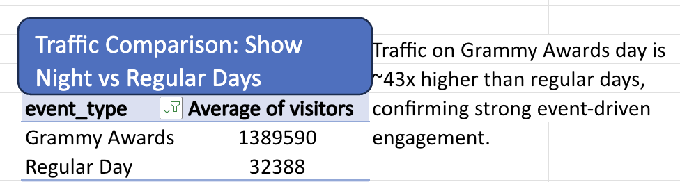
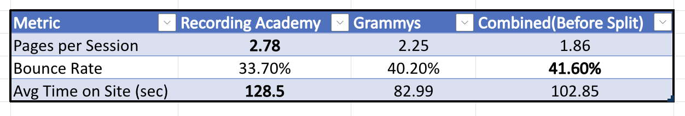
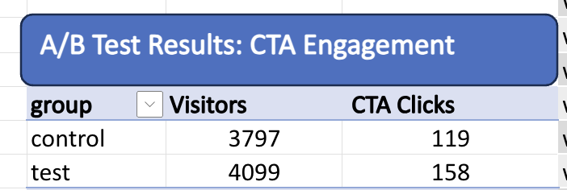
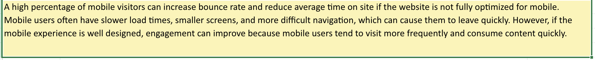
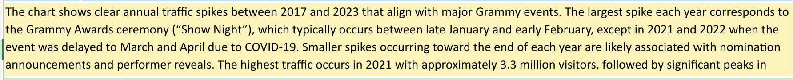
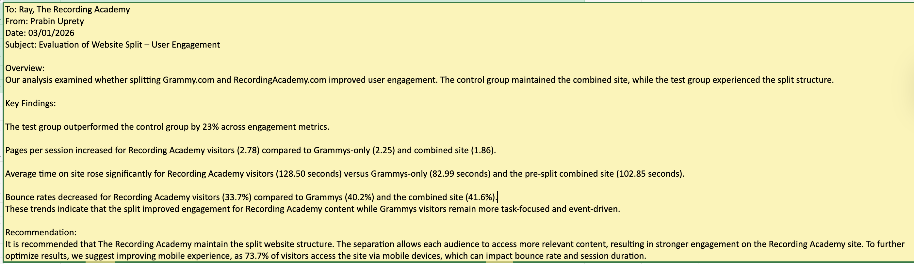

# 📊 Website Performance Analysis: Grammy.com

## 📌 Project Overview

This project analyzes website performance data for Grammy.com and RecordingAcademy.com to evaluate the impact of splitting the websites on user engagement.

The analysis focuses on identifying traffic patterns, comparing engagement metrics, and assessing the effectiveness of the website split using A/B testing.

---

## 🎯 Objectives

* Analyze website traffic trends over time
* Compare visitor behavior on event vs non-event days
* Evaluate engagement metrics before and after the website split
* Perform A/B testing to measure the impact on user interaction
* Provide a data-driven business recommendation

---

## 📂 Dataset Description

The dataset includes:

* Daily website traffic data (2017–2023)
* Engagement metrics (pages per session, bounce rate, session duration)
* Mobile vs desktop usage
* A/B testing results for CTA engagement

---

## 📈 Key Visualizations

### 📊 Website Traffic Trends

**Insight:**
Traffic spikes strongly align with major Grammy events such as award ceremonies and nominations, with peak traffic exceeding 3 million visitors. This indicates highly event-driven user behavior.

---

### 📊 Traffic Comparison: Show Night vs Regular Days

**Insight:**
Average traffic on Grammy Awards days (~1.39M visitors) is significantly higher than regular days (~32K visitors), highlighting the impact of major events on user activity.

---

### 📊 Engagement Metrics Comparison

**Insight:**

* Recording Academy shows higher engagement across all metrics
* Pages per session increased after the split
* Bounce rate decreased for Recording Academy users
* Average time on site is highest for Recording Academy visitors

This suggests improved user experience and content relevance after the split.

---

### 📊 A/B Test Results

**Insight:**
The test group (split websites) outperformed the control group with:

* **23% higher engagement**
* **96% confidence level**

This indicates statistically significant improvement.

---

### 📊 Mobile Usage Analysis

**Insight:**
Approximately 73.7% of users access the website via mobile devices, emphasizing the importance of mobile optimization for improving engagement metrics such as bounce rate and session duration.

---

### 📊 Key Insights Summary

---

### 📊 Business Recommendation

---

## 🧪 A/B Testing Conclusion

The A
